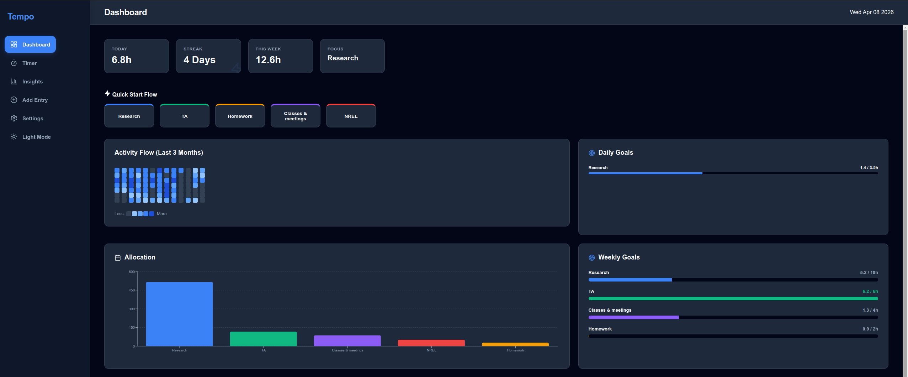

# ⏱️ Tempo

**Tempo** is a high-performance, focused time tracker designed for deep work, research, and technical mastery. It moves beyond messy spreadsheets and into a "Flow-first" environment where your progress is visualized and celebrated.


## ✨ Dashboard Preview


## 🚀 Key Features

-   **Deep Work Flow Timer:** A prominent, distraction-free timer with Zen audio cues to help you enter and maintain flow states.
-   **Mastery Dashboard:** A bird's-eye view of your focus week, including "Quick Start" project cards and daily intensity heatmaps.
-   **Intelligent Insights:** Visualize your time allocation across projects with interactive charts and peak productivity analysis.
-   **Multi-Tiered Goals:** Set specific **Daily** and **Weekly** hour targets. Progress bars "glow" once you hit your target.
-   **Universal Data Sync:** Seamlessly migrate your entire history from existing spreadsheets via a robust CSV import engine.
-   **Native & Portable:** Built for Linux (Ubuntu) with a native launcher and portable `.AppImage` support.

---

## 📖 How to Use Tempo

When you first open Tempo, your dashboard will be empty. Follow these steps to set up your productivity environment:

### 1. Adding your Projects (Categories)
Tempo organizes your time into **Projects**. There are two ways to add them:
*   **Manual Setup:** Go to the **Settings** tab. Use the "Add Category" form at the top to name your project (e.g., "Research", "Writing", "TA Duties") and pick a custom color.
*   **Automatic Import:** If you import a CSV file (see below), Tempo will automatically detect your column headers and create projects for you.

### 2. Setting Your Goals
Once a project is created, you can define your targets in the **Settings** tab:
1.  Click the **Edit (Pencil)** icon next to any project.
2.  Enter your **Daily Goal** (e.g., 4.0 hours) and **Weekly Goal** (e.g., 20 hours).
3.  Hit **Enter** or click the **Checkmark** to save.
4.  Your goals will now appear as progress bars on the **Dashboard**.

### 3. Entering Flow State
To track time, use the **Timer** tab or click a **Quick Start** card on the Dashboard. 
*   Click **"Enter Flow State"** to start the clock (you'll hear a start chime).
*   Click **"Finish Flow"** when you're done to log your time and hear the completion bell.

---

## 📊 Migrating your History
If you have an existing spreadsheet (like a Google Sheet), follow these steps:
1.  Open your sheet and go to **File > Download > Comma Separated Values (.csv)**.
2.  In Tempo, go to the **Settings** tab.
3.  Click **Select CSV File to Import**.
4.  Select your file. Tempo will instantly create any missing projects and backfill your entire history.

---

## 🛠️ Installation (Developers)

### Prerequisites
- [Node.js](https://nodejs.org/) (v18 or higher)
- npm

### Setup
```bash
git clone https://github.com/DesaulniersM/Tempo.git
cd tempo
npm install
npm run dev
```

## 📦 Building for Production
To create a standalone, portable Linux application (.AppImage):

### For Standard PCs (x64)
```bash
npm run build:linux
```

### For ARM Devices (Raspberry Pi, PineBook, etc.)
```bash
npx electron-builder --linux AppImage --arm64
```

## 💻 Multi-Architecture Support
Tempo supports both **x64** and **ARM64** Linux environments. Because it utilizes a native SQLite engine for high performance, ensure you build the AppImage for your specific hardware target.

---
*Tempo is a work in progress. Created for creators, researchers, and deep-thinkers.*
